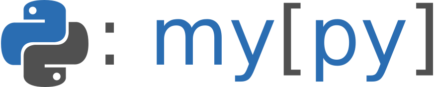

Mypy: Static Typing for Python
=======================================

[](https://pypi.org/project/mypy/)
[](https://pypistats.org/packages/mypy)
[](https://github.com/python/mypy/actions)
[](https://mypy.readthedocs.io/en/latest/?badge=latest)
[](https://gitter.im/python/typing?utm_source=badge&utm_medium=badge&utm_campaign=pr-badge&utm_content=badge)
[](https://mypy-lang.org/)
[](https://github.com/psf/black)
[](https://github.com/astral-sh/ruff)

Got a question?
---------------

We are always happy to answer questions! Here are some good places to ask them:

- for general questions about Python typing, try [typing discussions](https://github.com/python/typing/discussions)
- for anything you're curious about, try [gitter chat](https://gitter.im/python/typing)

If you're just getting started,
[the documentation](https://mypy.readthedocs.io/en/stable/index.html)
and [type hints cheat sheet](https://mypy.readthedocs.io/en/stable/cheat_sheet_py3.html)
can also help answer questions.

If you think you've found a bug:

- check our [common issues page](https://mypy.readthedocs.io/en/stable/common_issues.html)
- search our [issue tracker](https://github.com/python/mypy/issues) to see if
  it's already been reported

To report a bug or request an enhancement:

- report at [our issue tracker](https://github.com/python/mypy/issues)
- if the issue is with a specific library or function, consider reporting it at
  [typeshed tracker](https://github.com/python/typeshed/issues) or the issue
  tracker for that library

To discuss a new type system feature:

- discuss at [discuss.python.org](https://discuss.python.org/c/typing/32)
- there is also some historical discussion at the [typing-sig mailing list](https://mail.python.org/archives/list/typing-sig@python.org/) and the [python/typing repo](https://github.com/python/typing/issues)

What is mypy?
-------------

Mypy is a static type checker for Python.

Type checkers help ensure that you're using variables and functions in your code
correctly. With mypy, add type hints ([PEP 484](https://www.python.org/dev/peps/pep-0484/))
to your Python programs, and mypy will warn you when you use those types
incorrectly.

Python is a dynamic language, so usually you'll only see errors in your code
when you attempt to run it. Mypy is a *static* checker, so it finds bugs
in your programs without even running them!

Here is a small example to whet your appetite:

```python
number = input("What is your favourite number?")
print("It is", number + 1)  # error: Unsupported operand types for + ("str" and "int")
```

Adding type hints for mypy does not interfere with the way your program would
otherwise run. Think of type hints as similar to comments! You can always use
the Python interpreter to run your code, even if mypy reports errors.

Mypy is designed with gradual typing in mind. This means you can add type
hints to your code base slowly and that you can always fall back to dynamic
typing when static typing is not convenient.

Mypy has a powerful and easy-to-use type system, supporting features such as
type inference, generics, callable types, tuple types, union types,
structural subtyping and more. Using mypy will make your programs easier to
understand, debug, and maintain.

See [the documentation](https://mypy.readthedocs.io/en/stable/index.html) for
more examples and information.

In particular, see:

- [type hints cheat sheet](https://mypy.readthedocs.io/en/stable/cheat_sheet_py3.html)
- [getting started](https://mypy.readthedocs.io/en/stable/getting_started.html)
- [list of error codes](https://mypy.readthedocs.io/en/stable/error_code_list.html)

Quick start
-----------

Mypy can be installed using pip:

```bash
python3 -m pip install -U mypy
```

If you want to run the latest version of the code, you can install from the
repo directly:

```bash
python3 -m pip install -U git+https://github.com/python/mypy.git
```

Now you can type-check the [statically typed parts] of a program like this:

```bash
mypy PROGRAM
```

You can always use the Python interpreter to run your statically typed
programs, even if mypy reports type errors:

```bash
python3 PROGRAM
```

If you are working with large code bases, you can run mypy in
[daemon mode], that will give much faster (often sub-second) incremental updates:

```bash
dmypy run -- PROGRAM
```

You can also try mypy in an [online playground](https://mypy-play.net/) (developed by
Yusuke Miyazaki).

[statically typed parts]: https://mypy.readthedocs.io/en/latest/getting_started.html#function-signatures-and-dynamic-vs-static-typing
[daemon mode]: https://mypy.readthedocs.io/en/stable/mypy_daemon.html

Integrations
------------

Mypy can be integrated into popular IDEs:

- VS Code: provides [basic integration](https://code.visualstudio.com/docs/python/linting#_mypy) with mypy.
- Vim:
  - Using [Syntastic](https://github.com/vim-syntastic/syntastic): in `~/.vimrc` add
    `let g:syntastic_python_checkers=['mypy']`
  - Using [ALE](https://github.com/dense-analysis/ale): should be enabled by default when `mypy` is installed,
    or can be explicitly enabled by adding `let b:ale_linters = ['mypy']` in `~/vim/ftplugin/python.vim`
- Emacs: using [Flycheck](https://github.com/flycheck/)
- Sublime Text: [SublimeLinter-contrib-mypy](https://github.com/fredcallaway/SublimeLinter-contrib-mypy)
- PyCharm: [mypy plugin](https://github.com/dropbox/mypy-PyCharm-plugin)
- IDLE: [idlemypyextension](https://github.com/CoolCat467/idlemypyextension)
- pre-commit: use [pre-commit mirrors-mypy](https://github.com/pre-commit/mirrors-mypy), although
  note by default this will limit mypy's ability to analyse your third party dependencies.

Web site and documentation
--------------------------

Additional information is available at the web site:

  <https://www.mypy-lang.org/>

Jump straight to the documentation:

  <https://mypy.readthedocs.io/>

Follow along our changelog at:

  <https://mypy-lang.blogspot.com/>

Contributing
------------

Help in testing, development, documentation and other tasks is
highly appreciated and useful to the project. There are tasks for
contributors of all experience levels.

To get started with developing mypy, see [CONTRIBUTING.md](CONTRIBUTING.md).

Mypyc and compiled version of mypy
----------------------------------

[Mypyc](https://github.com/mypyc/mypyc) uses Python type hints to compile Python
modules to faster C extensions. Mypy is itself compiled using mypyc: this makes
mypy approximately 4 times faster than if interpreted!

To install an interpreted mypy instead, use:

```bash
python3 -m pip install --no-binary mypy -U mypy
```

To use a compiled version of a development
version of mypy, directly install a binary from
<https://github.com/mypyc/mypy_mypyc-wheels/releases/latest>.

To contribute to the mypyc project, check out the issue tracker at <https://github.com/mypyc/mypyc>
